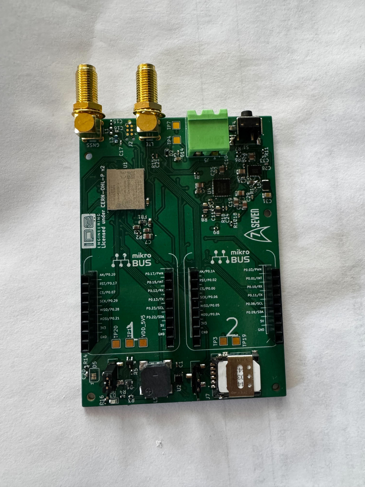

# seven-bringup

This is a bringup test application for [Seven](https://github.com/id8-engineering/seven-hardware/)
<p align="center">
  
</p>

## Prerequisites

* Install [nRF Util](https://docs.nordicsemi.com/bundle/nrfutil/page/guides/installing.html)
## Getting started

Find serial number from JLink:
```
nrfutil device list
```
Output should look like this:
```
(v3.2.1) [bobo@Bobo seven-bringup]$ nrfutil device list
853001439 # <--Serial number
Product         J-Link
Ports           /dev/ttyACM0
Traits          jlink, seggerUsb, serialPorts, usb

Supported devices found: 1
```

Flash modem firmware to Seven. Download this [zip](https://www.nordicsemi.com/Products/nRF9151/Download?lang=en#infotabs)and flash it using nrfutil:
```
nrfutil device program --firmware ~/Downloads/YOUR.zip --serial-number <INPUT SERIAL NUMBER HERE>
```

Before getting started, make sure you have a proper nRF Connect development environment.

### Install nRF Connect SDK

```
nrfutil install sdk-manager
```

### Install v3.2.1 SDK

```
nrfutil sdk-manager install v3.2.1
```

### Start the nRF Connect SDK toolchain shell

Use `nrfutil` to launch a shell with the correct nRF Connect SDK toolchain
environment:

```bash
nrfutil sdk-manager toolchain launch --ncs-version v3.2.1 --shell
```

If the command succeeds, your shell prompt will change to something like:

```bash
(v3.2.1) [user@host ~]$
```

All remaining commands in this guide should be run inside that shell.

### Set up workspace

Create a new workspace and enter it:

```bash
mkdir -p ~/src/seven-bringup-workspace && cd ~/src/seven-bringup-workspace
```

Initialize the workspace:

```bash
west init -m https://github.com/id8-engineering/seven-bringup --mr main .
```

Change into the project directory:

```bash
cd seven-bringup
```

Fetch and check out sources:

```bash
west update
```

### Build and flash firmware

Build application:

```bash
west build --sysbuild -p always -b seven/nrf9151/ns app/ -- \
-DBOARD_ROOT=$PWD \
-DDTS_ROOT=$PWD
```

Flash firmware:

```bash
west flash
```

### Console

Use west rtt

```bash
west rtt
```
